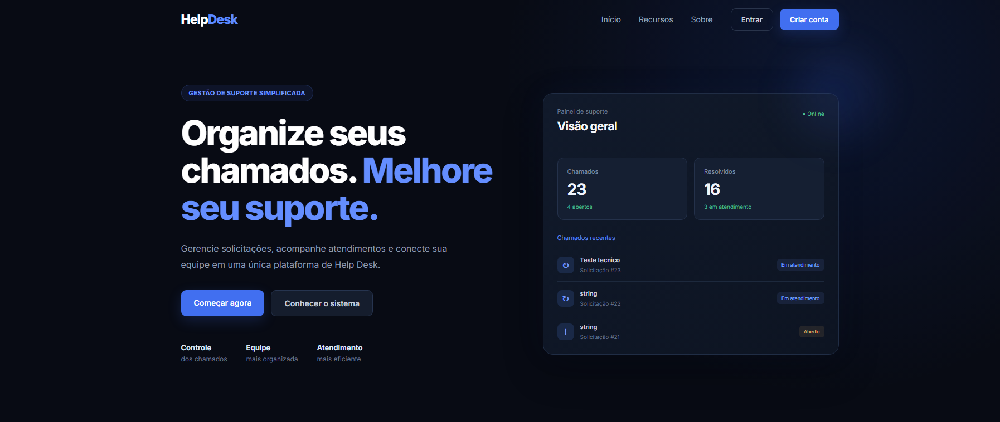
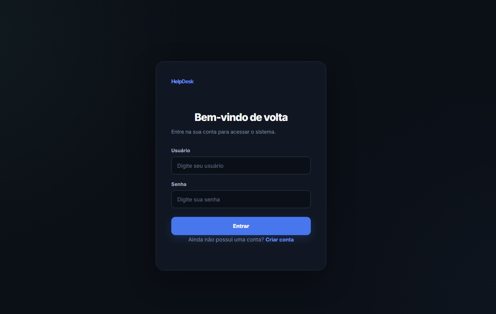
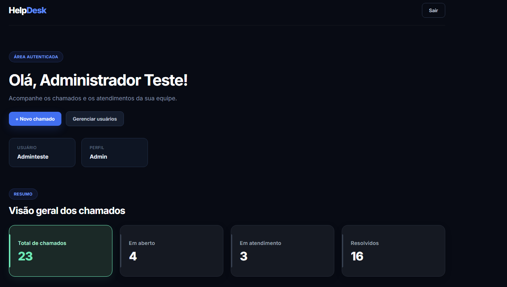
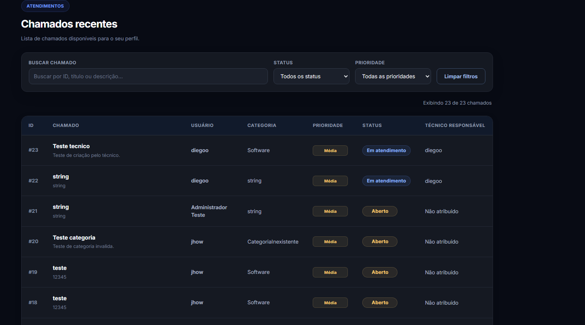
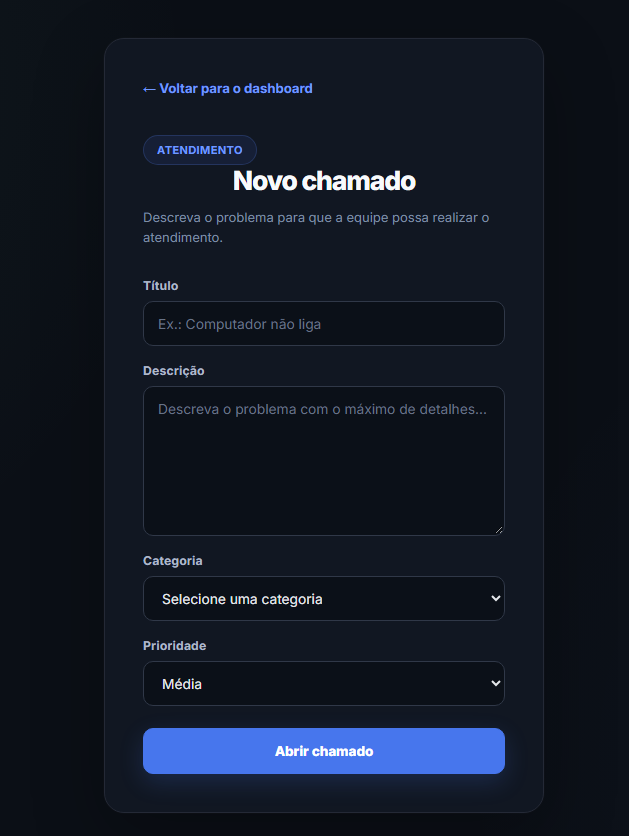
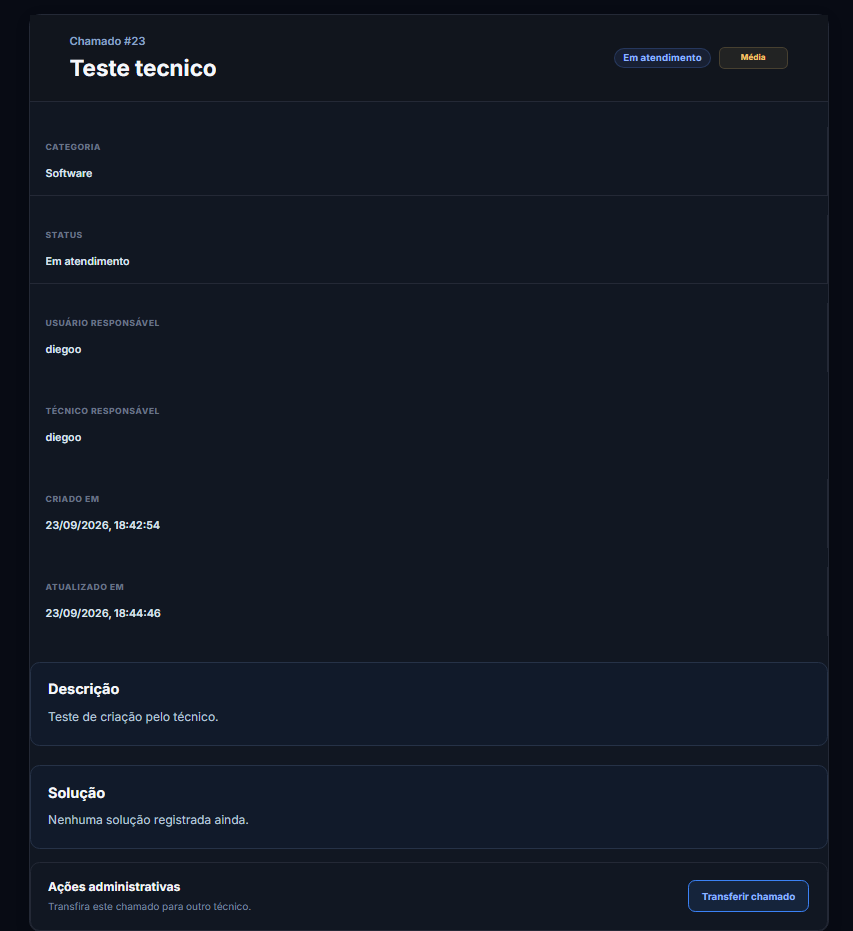
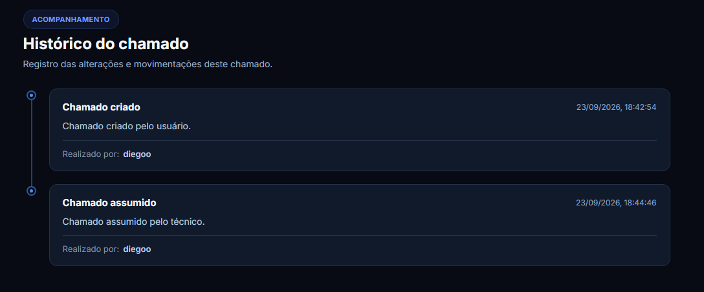
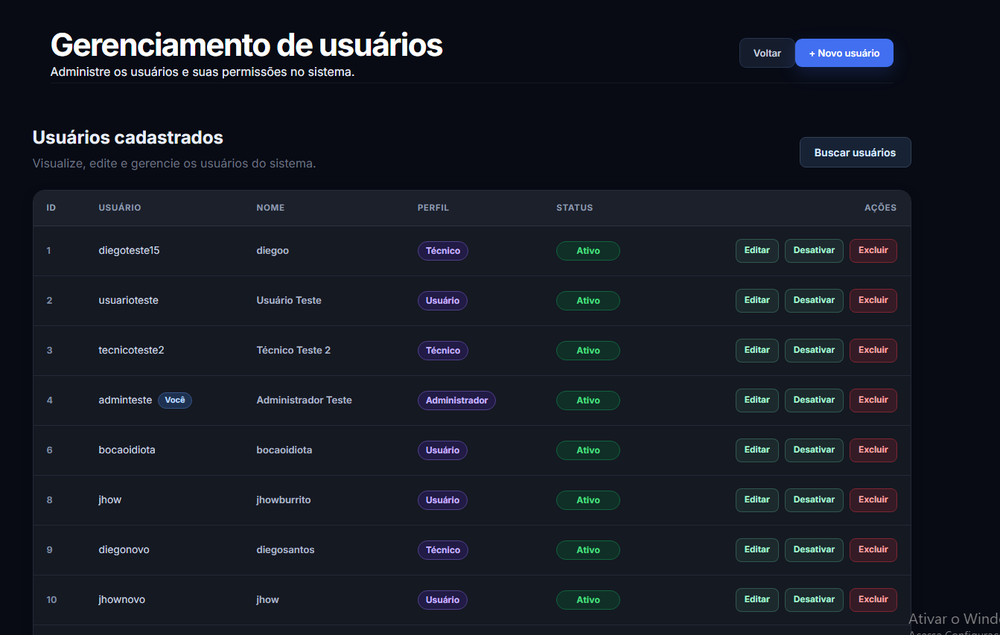

# HelpDesk Manager

A full-stack help desk management system built with FastAPI, React, PostgreSQL, and Docker.

## Overview

HelpDesk Manager is a full-stack application designed to organize technical support operations.

The system provides different access levels for users, technicians, and administrators, allowing support tickets to be created, assigned, handled, resolved, transferred, and tracked through their history.

The project was developed with a focus on backend architecture, authentication, authorization, database management, automated testing, and a React-based user interface.

## Features

### Authentication

- User login with JWT authentication
- Password hashing with bcrypt
- Protected API routes
- Role-based access control
- Authenticated user profile endpoint
- Account activation and deactivation

### Ticket Management

- Create support tickets
- View tickets
- View ticket details
- Assign tickets to technicians
- Assume tickets as a technician
- Resolve tickets
- Track ticket status
- Search and filter tickets
- View ticket history

### Ticket Transfer

Administrators can transfer tickets between active technicians.

The transfer operation records:

- Previous technician
- New technician
- Transfer reason
- Transfer action in the ticket history

### User Management

Administrators can:

- Create users
- View users
- Update user information
- Change user roles
- Activate or deactivate accounts
- Delete users

The system supports three user roles:

- `usuario`
- `tecnico`
- `admin`

### Public Home Page

The application home page displays public ticket statistics and recent ticket information retrieved directly from the backend API.

Displayed information includes:

- Total tickets
- Open tickets
- Tickets in progress
- Resolved tickets
- Recent tickets

## User Roles

| Role | Description |
|------|-------------|
| User | Creates and follows support tickets |
| Technician | Handles assigned tickets and resolves support requests |
| Admin | Manages users and has administrative control over tickets |

## Ticket Workflow

Tickets follow a defined lifecycle:

```text
Open → In Progress → Resolved
```

Once a ticket is resolved, the same ticket is not reopened. A new issue can be registered as a new ticket.

## Tech Stack

### Backend

- Python
- FastAPI
- SQLAlchemy
- Pydantic
- PostgreSQL
- Alembic
- JWT
- bcrypt
- Pytest

### Frontend

- React
- JavaScript
- Vite
- HTML
- CSS

### Infrastructure

- Docker
- Docker Compose
- PostgreSQL 17

## Architecture

The backend follows a layered structure separating application responsibilities:

```text
backend/
├── alembic/
├── app/
│   ├── auth/
│   ├── database/
│   ├── exceptions/
│   ├── models/
│   ├── routers/
│   ├── schemas/
│   └── services/
└── tests/
```

The application separates:

- Authentication and security
- Database configuration
- Database models
- Request and response schemas
- API routes
- Business logic
- Automated tests

The frontend is organized around React pages and application components:

```text
frontend/
├── public/
└── src/
    ├── assets/
    ├── pages/
    ├── App.jsx
    ├── App.css
    ├── index.css
    └── main.jsx
```

## Authentication & Authorization

Authentication is implemented using JSON Web Tokens (JWT).

Passwords are securely hashed before being stored.

Authorization is based on user roles, ensuring that administrative operations are restricted to users with the `admin` profile.

Protected operations include:

- User administration
- Ticket administration
- Ticket transfers
- Technician-specific operations

The API also prevents administrators from accidentally removing or disabling their own administrative access.

## API

The backend provides REST API endpoints for authentication, users, tickets, ticket history, and administrative operations.

Main endpoint groups include:

```text
POST   /usuarios/
POST   /usuarios/login
GET    /usuarios/me
GET    /usuarios/
POST   /usuarios/admin
PUT    /usuarios/{usuario_id}
DELETE /usuarios/{usuario_id}

POST   /chamados/
GET    /chamados/
GET    /chamados/tecnico
GET    /chamados/publico
GET    /chamados/{chamado_id}
POST   /chamados/{chamado_id}/assumir
POST   /chamados/{chamado_id}/resolver
GET    /chamados/{chamado_id}/historico
POST   /chamados/{chamado_id}/transferir
```

FastAPI also provides interactive API documentation through Swagger UI.

When running locally, it is available at:

`http://localhost:8000/docs`

## Database

The application uses PostgreSQL as its relational database.

Database schema changes are managed with Alembic migrations.

The main entities include:

- Users
- Tickets
- Ticket history

PostgreSQL runs through Docker Compose using PostgreSQL 17.

## Testing

The backend includes automated tests using Pytest.

Current test status:

```text
29 passed
```

The test suite covers authentication, users, permissions, tickets, administrative operations, and ticket workflows.

Run the tests with:

```bash
python -m pytest -q
```

## Getting Started

### Prerequisites

Make sure the following tools are installed:

- Python 3.14+
- Node.js
- npm
- Docker Desktop
- Git

### Clone the Repository

```bash
git clone <repository-url>
cd helpdesk-manager
```

### Environment Variables

Create a `.env` file inside the `backend` directory.

Example:

```env
DATABASE_URL=postgresql+psycopg://<database_user>:<database_password>@127.0.0.1:5433/helpdesk_manager
SECRET_KEY=your_secret_key
ALGORITHM=HS256
ACCESS_TOKEN_EXPIRE_MINUTES=30
```

Do not commit your `.env` file to the repository.

### Start PostgreSQL

From the project root:

```bash
docker compose up -d
```

Check the database container:

```bash
docker compose ps
```

### Backend Setup

Open a terminal:

```powershell
cd backend
```

Create and activate a virtual environment:

```powershell
python -m venv .venv
.\.venv\Scripts\Activate.ps1
```

Install the dependencies:

```powershell
python -m pip install -r requirements.txt
```

Run the backend:

```powershell
uvicorn app.main:app --reload
```

The API will be available at:

`http://localhost:8000`

Swagger documentation:

`http://localhost:8000/docs`

### Frontend Setup

Open another terminal:

```powershell
cd frontend
npm install
npm run dev
```

The frontend will be available at:

`http://localhost:5173`

## Project Structure

```text
helpdesk-manager/
│
├── backend/
│   ├── alembic/
│   │   └── versions/
│   ├── app/
│   │   ├── auth/
│   │   ├── database/
│   │   ├── exceptions/
│   │   ├── models/
│   │   ├── routers/
│   │   ├── schemas/
│   │   └── services/
│   ├── tests/
│   ├── alembic.ini
│   ├── main.py
│   └── requirements.txt
│
├── frontend/
│   ├── public/
│   ├── src/
│   │   ├── assets/
│   │   └── pages/
│   ├── package.json
│   └── vite.config.js
│
├── docs/
├── docker-compose.yml
└── README.md
```

## Screenshots

The following screenshots showcase the main areas of the application.

### Home



### Login



### Dashboard — Overview



### Dashboard — Ticket List



### New Ticket



### Ticket Details



### Ticket History



### User Management



## Future Improvements

Possible future improvements include:

- Production deployment
- Automated CI/CD pipeline
- Additional notification channels
- More advanced reporting and analytics
- Expanded automated test coverage
- Improved production monitoring

## Author

**Diego Santos**

Computer Science student focused on full-stack development and backend engineering.
